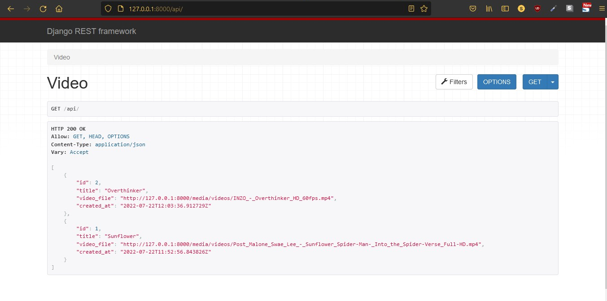
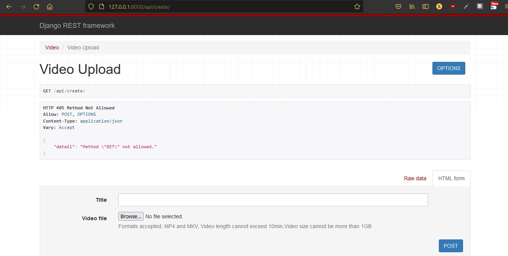
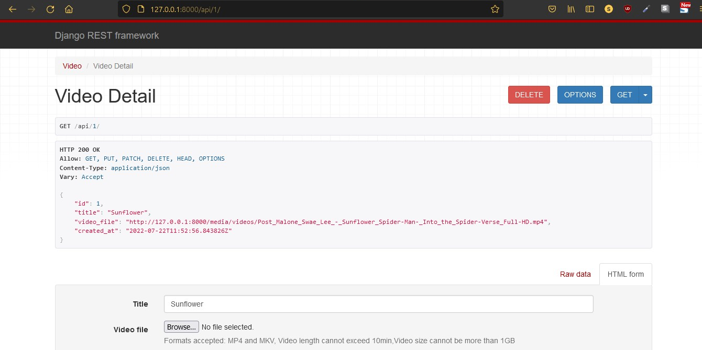

# Django rest framework: Video upload site
This project was created as a task for internship.

This is a very simple django rest api program.

## Running this project
To get this project up and running you should start by having Python installed on your computer. It's advised you create a virtual environment to store your projects dependencies separately. You can install virtualenv with

```
pip install virtualenv
```

Clone or download this repository and open it in your editor of choice. In a terminal (mac/linux) or windows terminal, run the following command in the base directory of this project

```
virtualenv env
```

That will create a new folder `env` in your project directory. Next activate it with this command on mac/linux:

```
source env/bin/active
```

Then install the project dependencies with

```
pip install -r requirements.txt
```

Now you can run the project with this command

```
python manage.py runserver
```

**Note** The charges for upload is only seen in the terminal.

---
## Output
```
http://127.0.0.1:8000/api/ 
```
]
```
http://127.0.0.1:8000/api/create/
```
]
```
http://127.0.0.1:8000/api/1
```
]
